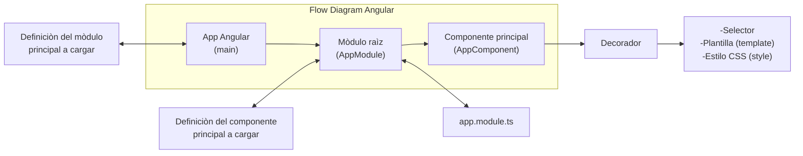
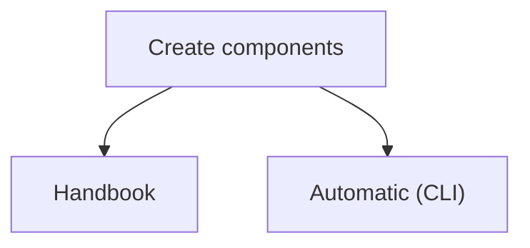

<!---
hugojose14/hugojose14 is a ✨ special ✨ repository because its `README.md` (this file) appears on your GitHub profile.
You can click the Preview link to take a look at your changes.
--->

# Angular For Begginers Course

## 🛠 Skills do you need
Javascript, Typescript, HTML, CSS...

## How to learn angular in 2022

In this file you can learn angular for begginers, for example how do you use routes, environments, login,forms, services, routing, also how to create your first app. 

## What is angular?

Is a framework for create web applications SPA (single page application)

## Who is its creator ? 
- Google 

## What features do it have? 

- Separate frontend and backend of the application
- Simplify code
- It follows the pattern MVC
- Based in components
- Is open source

## What language do it use?
- Typescript

## Why do you use this framework?
- Developtment of apps is very fast (The navegation is same)
- Is modular (reuse)
- Easy maintenance
- Multi platform
- Biggest community
- Steady future 

## What software do you need? 

- Node.js (you can execute javascript of the side server or client)
- Npm (Node package manager)
- Angular CLI (Command Line Interface)
- Visual studio code

## Installation Angular

Install angular with npm
```bash
npm install -g @angular/cli
cd my-project
```

## Create your first project
Run the CLI command ng new and provide the name my-app, as shown here:
```bash
ng new my-app
cd my-project
```

## Run the application
Execute next commands (angular CLI includes a server)

```bash
cd my-project
ng serve --open
```

other alternative is 

```bash
cd my-project
npm start
```

##  Project structure 


## SPA (Single Page Application)

A single page that is loaded in the initial request and then on that page when the user is modifying things are appearing or disappearing


**AJAX**: Stands for Asynchronous JavaScript And XML.

**JSON**: Javascript object anottation (file for change information between client and server).

## Flow diagram of angular


#### Example flow diagram


## How to create a component?




#### Command for create a component 

Open your terminal and run next command
```bash
ng generate component name-component
#short form
ng g c name-component
    
```


## Feedback

If you have any feedback, please reach out to us at hugo.jose.1@hotmail.com


    

