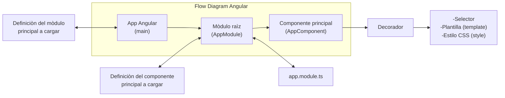
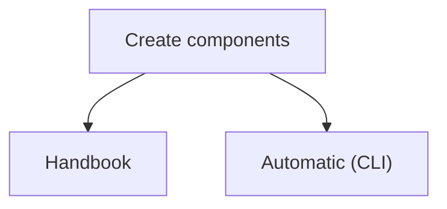
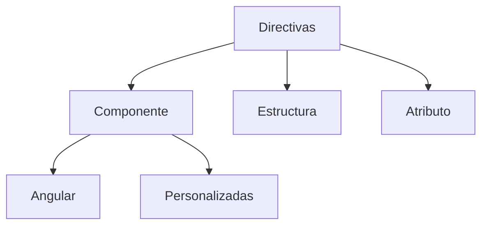

<!---
hugojose14/hugojose14 is a ✨ special ✨ repository because its `README.md` (this file) appears on your GitHub profile.
You can click the Preview link to take a look at your changes.
--->

# Angular For Begginers Course

## 🛠 Basic concepts what do you need to know before learning Angular
Javascript, Typescript, HTML, CSS...

- HTML 5
  - https://medium.com/hackernoon/learn-basic-html-be230361457
  - https://medium.com/singapore-rails-learning-group/basic-html-concepts-you-absolutely-need-to-know-7767bb629924

- CSS 
  - https://medium.com/@iampika/html-and-css-fundamentals-6b8f7d90911b
  - https://medium.com/@ankurdhamija83/understanding-the-concept-of-css-web-development-basics-bc7e864b864f
  
- Javascript 
  - https://medium.com/swlh/introduction-to-javascript-basics-cf901c05ca47
  - https://medium.com/entendiendo-javascript
   
- Typescript 
  - https://medium.com/front-end-weekly/learn-typescript-in-15-minutes-bf921cf355f5
  - https://medium.com/jspoint/typescript-a-beginners-guide-6956fe8bcf9e

## How to learn angular in 2022

In this file you can learn angular for begginers, for example how do you use routes, environments, login,forms, services, routing, also how to create your first app. 

## What is angular?

Is a framework for create web applications SPA (single page application)

## Who is its creator ? 
- Google 

## What features do it have? 

- Separate frontend and backend of the application
- Simplify code
- It follows the pattern MVC
- Based in components
- Is open source

## What language do it use?
- Typescript

## Why do you use this framework?
- Developtment of apps is very fast (The navegation is same)
- Is modular (reuse)
- Easy maintenance
- Multi platform
- Biggest community
- Steady future 

## What software do you need? 

- Node.js (you can execute javascript of the side server or client)
- Npm (Node package manager)
- Angular CLI (Command Line Interface)
- Visual studio code

## Installation Angular

Install angular with npm
```bash
npm install -g @angular/cli
cd my-project
```

## Create your first project
Run the CLI command ng new and provide the name my-app, as shown here:
```bash
ng new my-app
cd my-project
```

## Run the application
Execute next commands (angular CLI includes a server)

```bash
cd my-project
ng serve --open
```

other alternative is 

```bash
cd my-project
npm start
```

##  Project structure 


## SPA (Single Page Application)

A single page that is loaded in the initial request and then on that page when the user is modifying things are appearing or disappearing


**AJAX**: Stands for Asynchronous JavaScript And XML.

**JSON**: Javascript object anottation (file for change information between client and server).

## Flow diagram of angular


#### Example flow diagram


## How to create a component?




#### Command for create a component 

Open your terminal and run next command
```bash
ng generate component name-component
#short form
ng g c name-component
#Command for create component inline (don't include html or css) 
ng g c name-component -s -t 
    
```

## Interpolation of string 

Interpolation refers to embedding expressions into marked up text. By default, interpolation uses the double curly braces {{ and }} as delimiters.

```html

currentCustomer = 'Maria';
<!--Use interpolation to display the value of this variable in the corresponding component template:-->
<h3>Current customer: {{ currentCustomer }}</h3>

<!--Angular replaces currentCustomer with the string value of the corresponding component property. In this case, the value is Maria.
-->

<p>{{title}}</p>
<div></div>
```

## Property Binding


#### Example: how to use binding? 


## Event Binding


## Biding bidirectional (Two way binding)


#### Example two way binding 


#### Abstract property binding, event binding and two way binding (NgModel and banana in box)


## What need we for applicate two way binding? 

* Use directive NgModel 
* Use Banana in box  [()]

## What is a Module in angular ? 

Para poder continuar manteniendo este orden en nuestros proyectos, Angular, nos provee de módulos que son capaces de agrupar/contener en su interior a componentes, directivas, formularios, clases, interfaces, etc.

Por tanto, los módulos son mecanismo para subdividir en partes nuestra aplicación. El proceso de subdividir una aplicación en módulos recibe el nombre de modularizar/modularización.


## Directivas 

#### ¿What is a directive? 

- Elemento que se aplica a la etiqueta HTML que añaden funcionalidad a la etiqueta donde se aplican 
- Nos van a permitir quitar elementos del DOM (Parrafos, imagenes, etc) de acuerdo a ciertas restricciones

##### ¿How do they work?

- Para modfificar la estructura del DOM 
- Modificar la apariencia

##### Directive Types


#Example directives
                
+ Atributo
    + ngClass
    + ngStyle
    + ngModel
+ Estructural 
    + ngIf
    + ngFor
    + ngSwitch
    + ngPlural
    + ngTemplate
    + ngComponentOutlet
+ Componente
    + Angular (Agregar un decordador)
       + @Component
       + @Module
    + Personalizadas (Custom)

#### Diference between NgStyle vs NgClass

**ngStyle** : Nos permite agregar un estilo a una propiedad  u objeto dentro del DOM (una etiqueta en especial por ejemplo) y se aplica utilizando la siguiente 
directiva [ngStyle] = "{propiedad: condicion? 'x-estilo': 'y-estilo'}"

```html
<p *ngIf="registrado; else  sinRegistrar" >{{mensaje}} con el nombre: {{nombre}} {{apellido}}  
  y tiene el cargo de: <span [ngStyle]="{color: cargo =='director'? 'red': 'black'}">{{cargo}}</span></p>
```

**ngClass**  : Nos permite agregar n cantidad de estilos externalizados a un elemento del DOM (ejemplo del *.componente.css aplico mis estilos y lo llamo utilizando la directica [ngClass] = "{propiedad-css: condicion}"

  1. Necesitas crear en el *.component.css el estilo (debe ser una clase) -> inicia con "." una clase en css
  2. Luego debes llamar ese estilo con la directiva [ngClass] = ""

```css
.paraDirectores{
    color:red;
    font-weight: bold;
    text-decoration: underline;
}
```

```html
<p *ngIf="registrado; else  sinRegistrar" >{{mensaje}} con el nombre: {{nombre}} {{apellido}}  
  y tiene el cargo de: <span [ngClass]="{paraDirectores:cargo=='director'}">{{cargo}}</span></p>
```

## Comunicaciòn entre componentes (Enviar informaciòn padre -> hijo y hijo <- padre)

**@Input** De padre a hijo

**@Ouput** De hijo a padre


#### Example @Input 

1. Importa esto en tu componente hijo

```angular
import { Component, Input } from '@angular/core';
```
2. Colocar un identificador para cada propiedad que quiero enviar al componente hijo 


3. Apoyarse de la anotaciòn @Input en el componente hijo y setear las propiedades (cabe mencionar que debe ir el nombre de la propiedad que colocamos 
con su identificador)

```javascript
export class EmpleadoHijoComponent {
  @Input() empleadoDeLista:Empleado;
  @Input() indice: number;
}
```

4. Ya desde el componente hijo podemos acceder a las propiedades (con el nombre del identificador que le colocamos a la propiedad) 


#### Example Output (Enviar data del componente hijo al padre) 

1. Importa esto en tu componente hijo

```angular
import { Output, EventEmitter } from '@angular/core';
```
2. Agregar el @Output y el mètodo en la clase del component.ts (hijo)

```angular
 @Output() caracteristicasEmpleados = new EventEmitter<string>();
  
  agregaCaracteristicas(value: string) {
    this.caracteristicasEmpleados.emit(value);
  }
```
3. Agregar en el template hijo lo sigiuiente


4. Luego ir al componente padre y agregar lo siguiente 

```javascript
//Esto viene siendo el Array donde se va a agregar cada caracteristicas del empleado
 caracteristicas:Array<String>=[];

  agregarCaracteristica(nuevaCaracteristica:string){
   this.caracteristicas.push(nuevaCaracteristica);
  }
```

5. Luego en el template


## Services

Un servicio es típicamente una clase con un propósito limitado y bien definido. Debe hacer algo específico y hacerlo bien. Angular distingue los componentes de los servicios para aumentar la modularidad y la reutilización.

Tal como la documentación de Angular indica, un Componente no debe tener la responsabilidad de consultar datos o almacenarlos, esa responsabilidad es para los Servicios.

El trabajo de un servicio es el de controlar la información, desde obtenerla, almacenarla, actualizarla y compartirla con los componentes.

No hay nada especial acerca de un Servicio en Angular, excepto que estos deben de integrarse con los componentes vía el inyector de Dependencias de Angular.

#### Jerarquìa de un servicio en Angular 

- A nivel global: Disponible para toda la aplicaciòn.
- A nivel de modulo: Donde tenemos el servicio disponible solo a los componentes que 
pertenecen a ese modulo.
- A nivel de componente:  Que es donde tenemos el servicio disponible para dicho componente.

#### Ejemplo de jerarquìa de servicios

```bash
--app
  --one
    one.module.ts
    --services

  --two
    two.module.ts
    --services
```

```bash
ng g service one/services/myNewServiceFolderName/serviceOne --module one/one

--one
  one.module.ts // service imported and added to providers.
  --services
    --myNewServiceFolderName
      serviceOne.service.ts
      serviceOne.service.spec.ts
```

Para que un servicio en Angular se inyecte correctamente, se debe registrar en el módulo principal, en un módulo específico o en un componente. Un servicio registrado en el módulo principal será visible para toda la app.

Un provider es una instrucción para el sistema de Inyección de Dependencias de cómo obtener un valor para una dependencia.

Dependencia: al consumo de los servicios inyectables se le conoce como dependencia. Cada componente o servicio puede declarar en su constructor sus dependencias hacia servicios inyectables.

**Fuente:** https://medium.com/@cristianflores.ee/providers-en-angular-1832e8093e2a#:~:text=El%20servicio%20es%20una%20clase,el%20inyector%20ra%C3%ADz%20(AppModule).

## Routing (Poder enrutar con otras paginas)

- Nuestra app hoy dìa:


Imagen tomada de: https://www.youtube.com/watch?v=BhRpBIhRWbY&list=PLU8oAlHdN5BnNAe8zXnuBNzKID39DUwcO&index=24

- Donde queremos llegar: 


Imagen tomada de: https://www.youtube.com/watch?v=BhRpBIhRWbY&list=PLU8oAlHdN5BnNAe8zXnuBNzKID39DUwcO&index=24

**Importante a la hora de utilizar Routing**

1. Tendremos una barra de navegaciòn con: Home, Proyectos, Quiènes somos, Contacto 
2. Importante que es el componente principal (App.Component) el encargado de gestionar el enrutamiento

Si quieres aprender màs sobre el routing en angular mirar el siguiente enlace: https://angular.io/guide/router

**Pasos para enrutar en angular** 

**PreRequisito**: 
  - Tener definido en el componente principal app.component.html el menù (navbar) que nos va a servir para hacer el rooting de las url (tener definido nuestro menù principal)

```html
<nav class="navbar navbar-expand-sm bg-light">
  <!-- Links -->
  <ul class="navbar-nav">
    <li class="nav-item">
      <a class="nav-link" href="">Home</a>
    </li>
    <li class="nav-item">
      <a class="nav-link" href="">Proyecto</a>
    </li>
    <li class="nav-item">
      <a class="nav-link" href="">¿Quiènes somos?</a>
    </li>
    <li class="nav-item">
      <a class="nav-link" href="">Contacto</a>
    </li>
  </ul>
</nav>
```


1. Crear en tu archivo app.module.ts el siguiente arreglo con tus rutas 

```javascript
const appRoutes : Routes =  [
  //Se crea un objeto por cada ruta
  {path:'', component:HomeComponentComponent},
  {path:'/proyectos', component: ProyectosComponentComponent},
  {path:'/quienes-somos', component: QuienesComponentComponent},
  {path:'/contacto', component: ContactoComponentComponent},
];
```

2. Importas el Routes y el RouterModule 
```javascript
import { Routes,  RouterModule} from '@angular/router';
```

3. Dentro de los imports en tu App.module.ts aplicas lo siguiente al Modulo que agregamos (RouterModule)
```javascript
 imports: [
    BrowserModule,
    FormsModule,
    //Necesario para el tema del routing (le paso por argumento al forRoot la constante de rutas que creè anteriormente)
    RouterModule.forRoot(appRoutes)
  ],
```

4. Luego en el componente principal dentro del app.component.html especificar quièn serà el componente que va a gestionar todas las rutas 
agregando la siguiente etiqueta 

```html
<router-outlet></router-outlet>
```

5. Dentro del componente anterior donde definimos las rutas que son las siguientes, colocamos en el href las mismas rutas que definimos en el array 

```html
<nav class="navbar navbar-expand-sm bg-light">
  <!-- Links -->
  <ul class="navbar-nav">
    <li class="nav-item">
      <a class="nav-link" href="">Home</a>
    </li>
    <li class="nav-item">
      <a class="nav-link" href="/proyectos">Proyecto</a>
    </li>
    <li class="nav-item">
      <a class="nav-link" href="/quienes-somos">¿Quiènes somos?</a>
    </li>
    <li class="nav-item">
      <a class="nav-link" href="/contacto">Contacto</a>
    </li>
  </ul>
</nav>
```

## Routing programàtico (botones, links a las rutas) 

1. Crear el botòn 

```html 
<div style="text-align: center;">
    <button class="btn btn-primary" type="submit" (click) = "volverHome()">Ir a Inicio</button>
</div>
```

2. Crear tu mètodo volverHome() en el component.ts 

```javascript
import { Router } from '@angular/router';

//Inyectamos el servicio de Routin para enrutar
private router:Router

constructor(router:Router, empleadoService:EmpleadosService){
    this.router = router;
    this.empleadoService = empleadoService;
  }

  volverHome(){
    //El mètodo navigate me va a permitir ir donde yo quiera
    //Recordar que el home lo colocamos en el app.module.ts en el array de routing ""
    this.router.navigate(['']);
  }
```
## Ciclo de vida de un componente en angular 

https://medium.com/angular-chile/angular-componentes-y-sus-ciclos-de-vida-aa639e13a688

## Pruebas unitarias en Angular

https://medium.com/swlh/angular-unit-testing-jasmine-karma-step-by-step-e3376d110ab4

## Projecto bàsico de lo que deberìas saber en angular 

https://medium.com/bb-tutorials-and-thoughts/how-to-get-started-with-angular-c3c209d6fe90

## Run application (First App)

This project was generated with [Angular CLI](https://github.com/angular/angular-cli) version 15.0.3.

## Development server

Run `ng serve` for a dev server. Navigate to `http://localhost:4200/`. The application will automatically reload if you change any of the source files.

## Code scaffolding

Run `ng generate component component-name` to generate a new component. You can also use `ng generate directive|pipe|service|class|guard|interface|enum|module`.

## Build

Run `ng build` to build the project. The build artifacts will be stored in the `dist/` directory.

## Running unit tests

Run `ng test` to execute the unit tests via [Karma](https://karma-runner.github.io).

## Running end-to-end tests

Run `ng e2e` to execute the end-to-end tests via a platform of your choice. To use this command, you need to first add a package that implements end-to-end testing capabilities.

## Further help

To get more help on the Angular CLI use `ng help` or go check out the [Angular CLI Overview and Command Reference](https://angular.io/cli) page.


## Feedback

If you have any feedback, please reach out to us at hugo.jose.1@hotmail.com

## References
<a id="1">[1]</a> 
https://angular.io/guide/event-binding

<a id="2">[2]</a> 
https://www.youtube.com/watch?v=FPjFXQf1pqM&list=PLU8oAlHdN5BnNAe8zXnuBNzKID39DUwcO&index=10 (this is the best Angular course)

<a id="3">[3}</a> 
https://javadesde0.com/modularizando-nuestra-aplicacion-de-angular/

<a id="4">[4}</a> 
https://codigofacilito.com/articulos/angular-services

<a id="5">[5}</a> 
https://angular.io/guide/router


    
